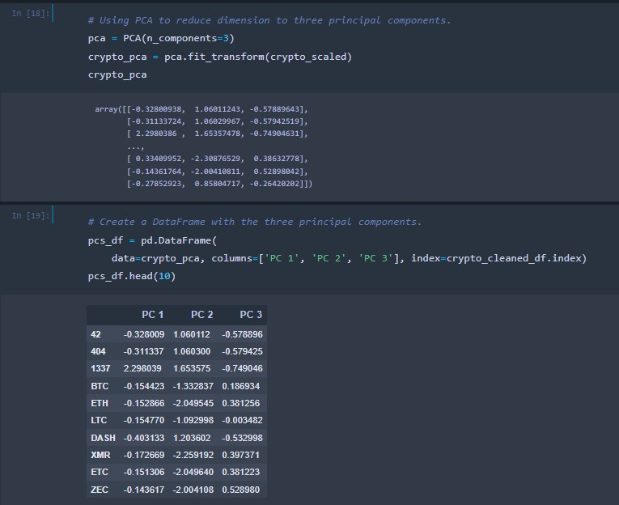
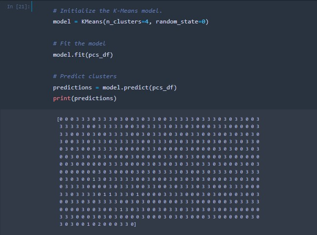
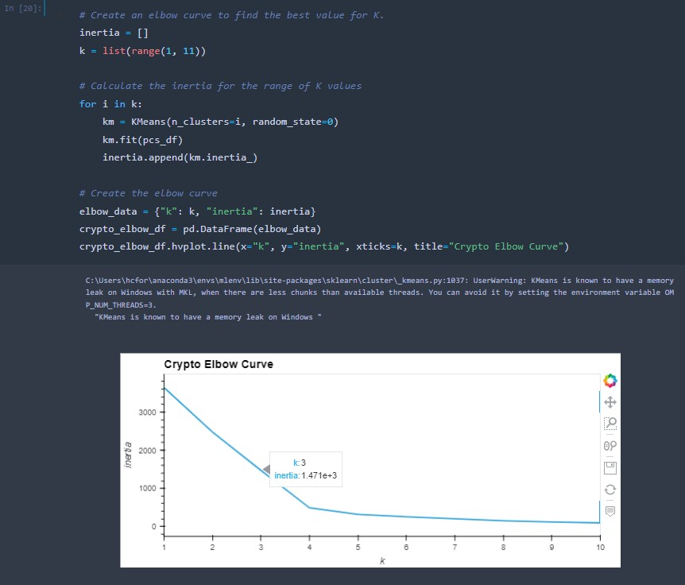
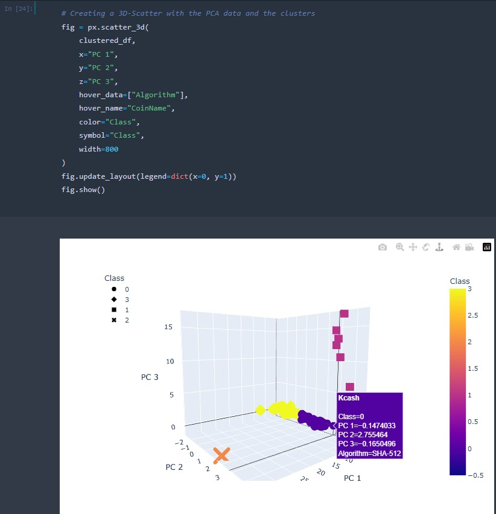
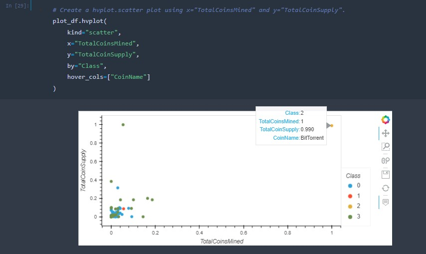
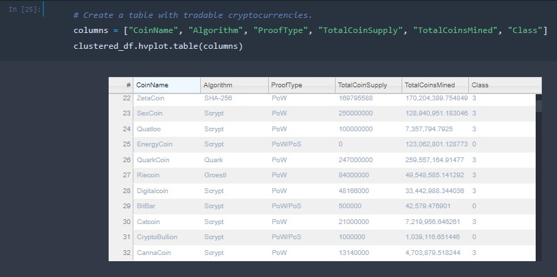
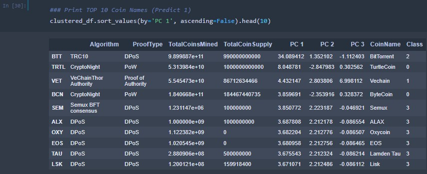
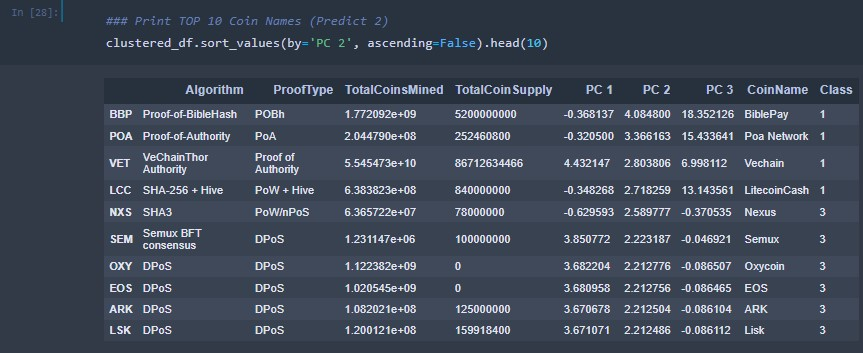
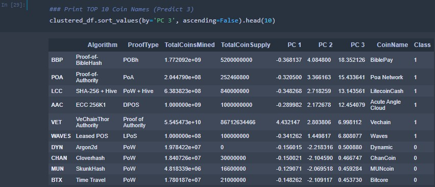

# Cryptocurrencies
 
## Analyzing cryptocurrencies with unsupervised machine learning algorithms and Python. 

### Project Overview

Machine learning and artificial intelligence use two basic processes, supervised and unsupervised learning, to operate. The primary difference is that supervised learning uses labeled data to predict outcomes while unsupervised learning does not. In supervised learning, data trains and supervises algorithms to classify information and predict outcomes. Unsupervised learning uses machine learning algorithms to analyze and cluster unlabeled data sets to uncover unseen patterns in data without the need for human interference. 

Cryptocurrency is an encrypted currency that exists digitally and uses cryptography to secure transactions. It does not have a central issuing and/or regulating authority and works as a peer-to-peer system, allowing its users to store it within digital wallets, and exchange virtually anywhere in the world. Although it can be used to purchase tangible goods, most users invest in it as they would in stocks. 

The purpose of this project is to analyze cryptocurrency data using unsupervised machine learning to find trends that make the different types of cryptocurrencies more attractive to invest in. In this scenario, the popular crypto options such as Bitcoin or Ethereum have become unaffordable to the general populous. Using unsupervised machine learning, the trends of altcoins (all other cryptocurrencies outside of Bitcoin) are explored to determine which ones would be the most profitable options to invest in. 

The dataset was provided by CryptoCompare, a reporting website founded in 2014 that provides real time pricing, charting and market analysis from the top twenty give crypto exchanges globally. 

### Resources

### Data Sets

* crypto_data.csv

#### Software

* Python Python 3.7.13 (Dependencies: Pandas 1.3.5,  SciKit-Learn 1.0, hvPlot 0.8.1, Plotly 5.10.0)
* Anaconda 2022.10
* Jupyter Notebook 6.4.12

### Results

The data used in this analysis was preprocessed and transformed using Pandas in the text editor, Jupyter Notebook, so it could fit unsupervised machine learning models. Null values were dropped, and the data set was transformed to only include tradeable and mined cryptocurrencies, and the data was numerically categorized as well as scaled. This reduced the data set analyzed below from 1252 cryptocurrencies to only 532.

PCA (Principal Component Analysis) was used to reduce data dimension. The crypto currencies were fit to the PCA data frame and clustered using the K-Means algorithm and were visualized in 2D and 3D scatterplots using hvPlot. The results below display a data frame (clustered_df) showing a class column that displays the predictions of each group the cryptocurrency fell into. 

#### Principal Component Analysis

#### K-Means

#### Elbow Curve

Observing the elbow curve below, the optimal number of clusters is 4 (k=4). This number is used to specify the number of clusters (n_clusters) when initializing the K-means model:

#### 3D Plot

The 3D scatter plot located each clustered cryptocurrency relation to the three principal components that were created in the PCA (Principal Component Analysis) analysis. As it is seen, there are 3 major groups and one major outlier, BitTorrent. 

#### hvPlot (Scatter)

When the clustered cryptocurrencies are grouped by class in the scatterplot below, two outliers are observed. The first outlier displays both a high supply as well as a higher number of mined coins (BitTorrent Crypto) and the other displays a high supply; however, a lower number of coins mined (TurtleCoin). 

#### hvTable
The hvTable below displays all of the currently tradeable cryptocurrencies. This table is created using the hvplot.table() function. This interactive table allows the user to scroll through the listed entries. 

### Conclusion

This analysis successfully grouped the cryptocurrencies into four groups. Bitcoin is visibly in its own class as visualized in both the 2D and 3D scatterplots. To provide a more insightful analysis on the trends of the altcoins studied in this data set, the Bitcoin data would need to be removed so the data could be redistributed, allowing us to visualize patterns in the altcoins more clearly. In this study, all other cryptocurrencies are essentially compared against Bitcoin. 
In an additional analysis, the top ten crypto currencies in three predictions were analyzed revealing that BitTorrent (results in the PC 1 table) would be a profitable choice amongst the altcoins to choose from in this analysis. The PC3 table below displays the best prediction results and infers that the BiblePay, Poa Network, LitecoinCash, Acute Angle Cloud, Vechain and Waves crypto options would also be investment contenders. 

